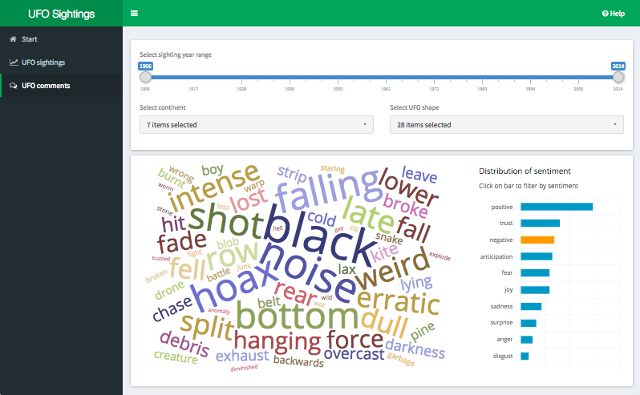
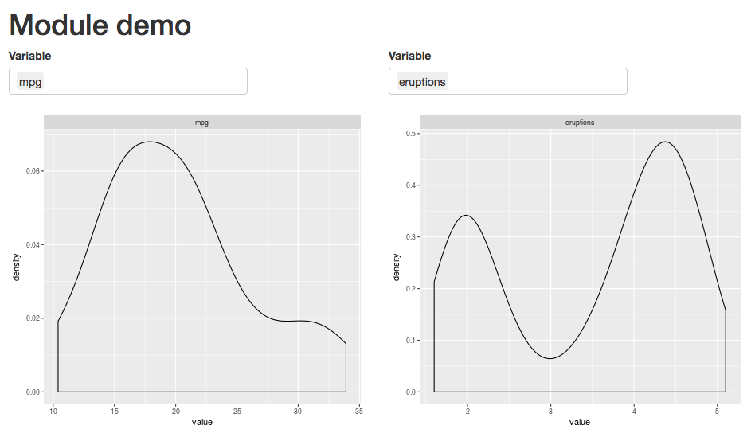

# Why using R???

## Two extremes to develop an app {.build}

<div class="columns-2">
### Off-the-shelf dashboards 
>- PowerBI, Tableau, QuickSight, ...
>- <div class="green">Easy to create, publish and share</div>
>- <div class="green">Rapid development</div>
>- <div class="red2">Limited customisation</div>
>- <div class="red2">No version control</div>
>- <div class="red2">Definition of charts buried in UI</div>
>- <div class="red2">No automatic testing</div>

### Custom web app
>- Angular, ReactJS, Ember, ...
>- <div class="green">Engineering control</div>
>- <div class="green">Flexibility</div>
>- <div class="red2">Learning curve</div>
>- <div class="red2">Costly development</div>
>- <div class="red2">Development spread across multiple teams</div>
</div>


## Meet Shiny

>- <div class="green">Code based -- version control, easy to collaboration, changelogs, clear chart definitions, easy search for help</div>
>- <div class="green">No deep HTML/CSS/JS knowledge required</div>
>- <div class="green">Reasonable flexibility</div>
>- <div class="green">Rapid development</div>


>- <div class="red2">Scalability</div>
>- <div class="red2">Performance</div>
>- <div class="red2">Requires deployment and security</div>


# Development

## UFOs anyone?



<div style="width:70%; margin-top: -40px; text-align: right">
  <a href="https://nz-stefan.shinyapps.io/ufo-sightings/" style="font-size: 10pt">
    https://nz-stefan.shinyapps.io/ufo-sightings/
  </a>
</div>


## Useful packages {.build}

### Themes
- [shinydashboard](https://rstudio.github.io/shinydashboard/) -- well supported Bootstrap theme
- [shinymaterial](https://ericrayanderson.github.io/shinymaterial/) -- "material design" theme

### Widgets
- [shinyWidgets](https://github.com/dreamRs/shinyWidgets) -- custom widgets to pimp your shiny apps
- [shinycssloaders](https://github.com/andrewsali/shinycssloaders) -- CSS loader animations for Shiny outputs
- [rintrojs](https://github.com/carlganz/rintrojs) -- step-by-step help messages


## Useful packages (2) {.build}

### Charts
- [highcharter](http://jkunst.com/highcharter/) -- fancy charts with animations and all
- [plotly](https://plot.ly/r/) -- fast rendering scientific charting engine
- [d3wordcloud](https://github.com/jbkunst/d3wordcloud) -- fancy word clouds

### Others
- [leaflet](https://rstudio.github.io/leaflet/) -- clickable interactive maps
- [DT](https://rstudio.github.io/DT/) -- clickable tables with filtering, pagination, sorting


## Modules {.build}

### Use case 1 
Break up complex logic into separate modules that can each be reasoned about independently.

### Use case 2
Independent components to be re-used across one or different apps

### Use case 3
Bundle up modules into R package to be used by other Shiny authors

## Module example in 43 lines of code



<div style="width:80%; margin-top: -40px; text-align: right">
  <a href="https://nz-stefan.shinyapps.io/shiny-module-example/" style="font-size: 10pt">
    https://nz-stefan.shinyapps.io/shiny-module-example/
  </a>
</div>


## Module example - UI

```{r eval=FALSE}
modulePlotterUI <- function(id) {
  ns <- NS(id)   # use different namespace for each module instance
  
  tagList(
    selectizeInput(         # define a select list input
      inputId = ns("var"),  
      label = "Variable", 
      choices = list(), 
      multiple = TRUE
    ),
    plotOutput(ns("plot"))  # define a chart output
  )
}
```

## Module example -- Server

```{r eval=FALSE}
modulePlotter <- function(input, output, session, d_plot) {
  observe({    # update select input with column names of dataframe
    choices <- d_plot() %>% colnames()
    updateSelectizeInput(session, "var", choices = choices, selected = choices[1])
  })
  
  output$plot <- renderPlot({
    req(input$var)
    d_plot() %>% 
      select(one_of(input$var)) %>%      # select column based on select input
      gather(key, value) %>%             # convert dataframe into long form
      ggplot(aes(x = value)) +        
      geom_density() +                   # plot densities
      facet_wrap(~key, scales = "free")  # one subplot per column
  })
}
```

## Module example -- App

```{r eval=FALSE}
ui <- fluidPage(
  h1("Module demo"),
  fluidRow(
    # create UI for two module instances
    column(width = 6, modulePlotterUI("mtcars")),
    column(width = 6, modulePlotterUI("faithful"))
  )
)

server <- function(input, output, session) {
  # link server logic for both module instances
  callModule(modulePlotter, "mtcars", reactive(mtcars))
  callModule(modulePlotter, "faithful", reactive(faithful))
}

shinyApp(ui, server)    # run Shiny app
```

## Packrat -- Dependency management for R {.build}

### Isolated 
- Packrat gives each project its own private package library

### Portable
- Easy to transport projects from one computer to another
- Easy to install all packages a project depends on

### Reproducible
- Packrat records exact package versions and ensures those exact versions get installed for a project

## Packrat -- Usage {.build}

#### Initialize packrat in project directory
```{r eval=FALSE}
packrat::init("~/projects/babynames")
```

#### Install packages as usual
```{r eval=FALSE}
install.packages("tidyverse")
```

#### Save changes in packrat
```{r eval=FALSE}
packrat::snapshot()
```

#### Restore library on different machine
```{r eval=FALSE}
packrat::restore()
```


# Data backends

## Elastic Search

>- Distributed, RESTful search and analytics engine
>- Stores schema-free JSON documents
>- Near real-time search and retrieval
>- Reasonably featured JSON based query language
  (boolean filters and aggregations, limited join capability)
>- Package [`elastic`](https://github.com/ropensci/elastic) provides interface from R
>- Package [`jqr`](https://cran.r-project.org/web/packages/jqr/vignettes/jqr_vignette.html) provides convenient and fast conversion of nested JSON response into dataframe


## Elastic Search -- Example

```
POST /twitter/_search
{
    "query": {
        "bool" : {
            "must" : {
                "query_string" : {
                    "query" : "some query string here"
                }
            },
            "filter" : {
                "term" : { "user" : "kimchy" }
            }
        }
    }
}
```

# Deployment

## shinyapps.io

### "Deploy your Shiny applications on the Web in minutes"
>- <div class="green">Push-button solution from RStudio</div>
>- <div class="green">Free tier available</div>
>- <div class="green">Convenient interface to tune deployment and see usage stats</div>
>- <div class="red">Deployed app may load up for little while</div>
>- <div class="red">Advanced features can be pricy</div>
>- <div class="red">No control over location of deployment</div>


## ShinyProxy

>- Deploy Shiny apps in an enterprise context
>- Enterprise features: authentication, scalability (wihtin reason), control over memory and CPU
>- Docker based -- Shiny app installed into docker container that spins up on user request
>- Java Spring responsible for user authentication and container spin-up

## ShinyProxy -- "Dockerizing" a Shiny app 

```
FROM openanalytics/r-base

# install required system libraries
RUN apt-get update && apt-get install -y sudo pandoc

# install required R packages
RUN R -e "install.packages(c('shiny', 'rmarkdown'), repos='https://cloud.r-project.org/')"

# copy the app to the image
RUN mkdir /root/euler
COPY euler /root/euler
COPY Rprofile.site /usr/lib/R/etc/

EXPOSE 3838

CMD ["R", "-e", "shiny::runApp('/root/euler')"]
```

## ShinyProxy + SSL

```{r echo=FALSE}
DiagrammeR::grViz("
digraph rmarkdown {
rankdir = LR
node [shape = box,
        fontname = Helvetica]
User; 'Web\nserver'; ShinyProxy; 'Shiny\ncontainer';

User -> 'Web\nserver' [label = 'https\nrequest']
'Web\nserver' -> ShinyProxy [label = 'forward\nrequest']
ShinyProxy -> 'Shiny\ncontainer' [label = 'spin up']
}
", height = 200)

```

- Web server, e.g. nginx, responsible for SSL encryption
- ShinyProxy responsible for user authentication
- Shiny container responsible for serving Shiny app


# Thank you!
